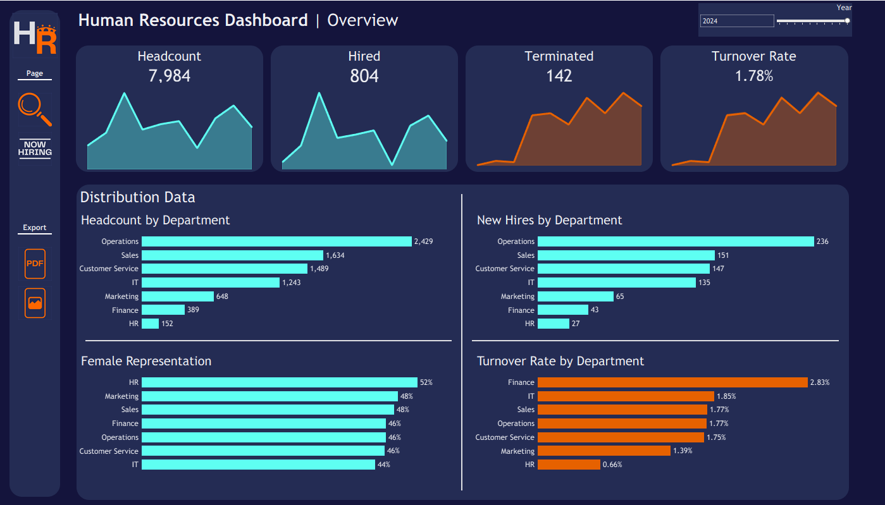
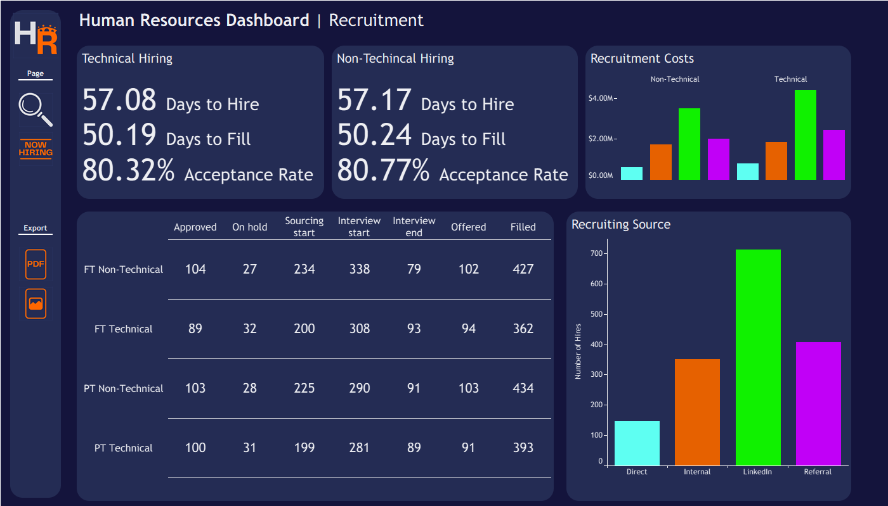

# 📊 HR Analytics Dashboard with Tableau  

## 🌟 Project Overview  
This project demonstrates how I designed and built a **two-page Tableau dashboard** to analyze key **HR and recruitment metrics** using **synthetic datasets**. My goal was to practice **data wrangling, visualization, and storytelling with HR data**, while showcasing a portfolio-ready project that mimics real-world HR analytics challenges.  

The dashboard highlights **employee lifecycle trends** (hires, terminations, headcount) as well as **recruitment efficiency metrics** (time to hire, cost per hire, acceptance rates, and pipeline health).  

👉 Explore how I planned, cleaned, and visualized HR data to deliver actionable insights for business stakeholders.  

---

## 🗂️ Dashboard Pages & Features  

### **Page 1: Workforce Overview**  
- **Trends over time** (area charts):  
  - Hires by Year  
  - Active Employees by Year  
  - Terminations by Year  
  - Termination Rate (%) by Year  
- **Workforce composition (bar charts):**  
  - Headcount by Department  
  - % of Women by Department  
  - New Hires by Department  
  - Terminations by Department  

### **Page 2: Recruitment Analytics**  
- **Efficiency KPIs:**  
  - Avg. Days to Hire  
  - Avg. Days to Fill  
  - Offer Acceptance Rate (Tech vs. Non-Tech)  
- **Recruitment Costs (column charts):**  
  - Sum of Bonuses Offered by Channel (Tech & Non-Tech)  
- **Hiring Funnel (column charts + table):**  
  - Hires by Channel (LinkedIn, Direct, Internal, Referral)  
  - Recruitment Pipeline (Approved → Filled), segmented by:  
    - Tech vs. Non-Tech roles  
    - Full-Time vs. Part-Time roles  

---

## 🛠️ Data Sources & Preparation  

This project combines **two synthetic HR datasets**:  

1. **Employee Lifecycle Data**  
   - Created by [Data With Baraa](https://www.youtube.com/@DataWithBaraa) using ChatGPT + Faker.  
   - I made light edits to adjust name data for realism.  

2. **Hiring Data**  
   - Sourced from Kaggle: [*Employee Hiring Data*](https://www.kaggle.com/datasets/malsha/employee-hiring-data) by Malsha.  
   - My edits included:  
     - Added `bonus_offer`, `recruiting_channel`, `city`, and `state` columns.  
     - Cleaned inconsistencies and prepared data for Tableau integration.  

📂 Repo includes:  
- **Data** (both raw and edited/cleaned).  
- **Notebooks** used for data wrangling.  

---

## 🚀 Workflow & Process  

1. **Planning the Use Case**  
   - Defined KPIs relevant to HR leaders: headcount trends, diversity insights, recruiting efficiency, and pipeline bottlenecks.  

2. **Data Preparation**  
   - Cleaned and transformed raw datasets in Python.  
   - Added engineered fields (e.g., bonus offers, recruiting channel categories).  
   - Exported final CSVs for Tableau.  

3. **Measures & Calculated Fields**  
   - Developed custom Tableau measures to support analysis, including:  
     - **Termination Rate** = Terminations ÷ Active Employees  
     - **Acceptance Rate** = Offers Accepted ÷ Offers Extended  
     - **Avg. Time-to-Fill / Time-to-Hire** (date difference calculations)  

4. **Visualization in Tableau**  
   - Built two separate dashboard pages: **Workforce Overview** and **Recruitment Analytics**.  
   - Selected appropriate chart types for clarity and storytelling.  
   - Ensured visual design supported **comparisons across departments, gender, role type, and recruitment channels**.  

5. **Insights & Storytelling**  
   - Highlighted workforce stability through hires vs. terminations.  
   - Revealed **recruiting inefficiencies** (longer fill times for tech roles).  
   - Showed **cost implications by hiring channel**.  
   - Identified **diversity imbalances across departments**.  

---

## 📸 Dashboard Preview  

<p align="center">
  
  
</p>

---

## 🔑 Key Skills Demonstrated  

- **Data Cleaning & Transformation**: Python, Pandas, synthetic data generation/editing.  
- **Data Visualization**: Tableau (area charts, bar charts, funnel tables).  
- **Storytelling with Data**: Framing HR metrics into a narrative for decision-makers.  
- **Version Control & Documentation**: GitHub for dataset management and project transparency.  
- **Measures & Calculated Fields**: Developed Tableau calculations to derive metrics such as termination rate, acceptance rate, and average time-to-fill.
- **Dashboard Design (Figma)**: Created a custom background in Figma for a polished and professional dashboard layout.  

---

## 📂 Repository Structure  

```plaintext
├── data/
│   ├── raw/                # Original Kaggle & Baraa datasets
│   ├── processed/          # Cleaned & edited datasets
├── images/                 # Screenshots of dashboard
├── notebooks/              # Python notebooks for data cleaning/processing
├── tableau/                # Packaged Tableau workbook (.twbx)
├── images/                 # Screenshots of dashboard
├── README.md               # Project documentation

